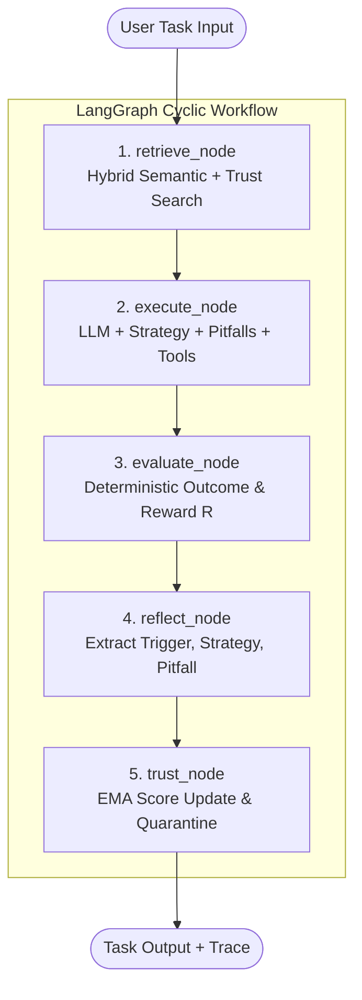

# High-Level Design (HLD)

**Project:** Adaptive AI Agent with Persistent Experience Memory  
**Group:** G146 (GenAI / Agentic AI OJT Capstone)  
**Status:** Approved Architecture Baseline (Month 2 Specification)  

---

## Architecture

The **Adaptive AI Agent with Persistent Experience Memory** is an external intelligence framework built around an unmodified, frozen Large Language Model (LLM). Its purpose is to solve the twin problems of *experience amnesia* and *negative transfer* across repeated task executions.

The system is organized into a clean 7-layer architectural stack:

```text
┌──────────────────────────────────────────────────────────────────────────┐
│ Layer 1: Client / Access Layer                                           │
│   • React 18 + Vite Dashboard [IMPLEMENTED]                              │
│   • Supabase Auth (GoTrue) Session Management [IMPLEMENTED]              │
│   • Three.js 3D Memory Core Visualizer [IMPLEMENTED]                     │
│   • Chrome Extension Manifest V3 [PLANNED CLIENT]                        │
└────────────────────────────────────┬─────────────────────────────────────┘
                                     │ HTTP REST / Bearer JWT
┌────────────────────────────────────▼─────────────────────────────────────┐
│ Layer 2: API Gateway Layer                                               │
│   • FastAPI Application (/api/v1) [CORE HEALTH IMPLEMENTED]              │
│   • Pydantic v2 Request & Response Data Contracts                        │
│   • JWT Verification Dependency & Rate Limiting                          │
└────────────────────────────────────┬─────────────────────────────────────┘
                                     │ Internal Dispatch
┌────────────────────────────────────▼─────────────────────────────────────┐
│ Layer 3: Agent Orchestration Engine                                      │
│   • LangGraph Cyclical StateGraph (5 Nodes)                              │
│   • Typed AgentState Channels (task, memories, trajectory, outcome)      │
│   • Deterministic Exit & Max-Iteration Guards (max 4 turns)              │
└────────────────────────────────────┬─────────────────────────────────────┘
                                     │
           ┌─────────────────────────┴─────────────────────────┐
           ▼                                                   ▼
┌──────────────────────────────────┐  ┌──────────────────────────────────┐
│ Layer 4: Model & Tools Gateway   │  │ Layer 5: Experience Intelligence │
│   • LiteLLM Multi-Model Proxy    │  │   • Hybrid Retrieval Engine      │
│     (Groq Llama-3.3 / Ollama /   │  │     (0.70*Sim + 0.30*Trust)      │
│      Gemini 1.5 Flash)           │  │   • Heuristic Evaluator (R ∈ 0..1│
│   • DuckDuckGo Search Tool       │  │   • Reflector (Lesson Extractor) │
│   • Jina AI Reader Tool          │  │   • Trust Engine (EMA Updates)   │
│   • Python REPL Execution Tool   │  │   • Lifecycle Controller         │
│   • Frozen Base LLM Weights      │  │     (candidate/active/deprecated)│
└──────────────────────────────────┘  └────────────────┬─────────────────┘
                                                       │
                                                       ▼
┌──────────────────────────────────────────────────────────────────────────┐
│ Layer 6: Data & Persistence Layer                                        │
│   • Supabase PostgreSQL 15 + pgvector Extension                          │
│   • Experiences Table (embedding vector(1536) / vector(384))            │
│   • Task Executions Log & Execution Experiences Junction Table           │
│   • Trust History Ledger (Immutable Append-Only Audit Trail)             │
│   • Row-Level Security (RLS) Policies & match_experiences RPC            │
└────────────────────────────────────┬─────────────────────────────────────┘
                                     │ Telemetry Spans & Metric Streams
┌────────────────────────────────────▼─────────────────────────────────────┐
│ Layer 7: Observability & Telemetry                                       │
│   • LangSmith Run Tracing & Node-Level Execution Trees                   │
│   • PostgreSQL Task Audit Records (run_id, latency, token_usage, cost)   │
│   • Loguru Structured JSON Logging                                       │
└──────────────────────────────────────────────────────────────────────────┘
```

### The 5-Node Agent Loop



---

## Components

| Component | Technology | Primary Responsibility | Status |
|---|---|---|---|
| **Web Dashboard** | React 18, Vite, Three.js, Tailwind CSS | Analyst interface, 3D memory visualization, task dispatch, real-time trust monitoring | Implemented |
| **Authentication & IAM** | Supabase Auth (GoTrue), JWT | User sign-up, sign-in, session tokens, user-isolated Row-Level Security (RLS) | Implemented |
| **API Gateway** | FastAPI, Uvicorn, Pydantic v2 | REST API endpoints, request validation, CORS, token verification, routing | Core `/health` Implemented |
| **Agent Workflow Engine** | LangGraph, LangChain Core | 5-node state machine (`retrieve` → `execute` → `evaluate` → `reflect` → `trust`) | Specification Complete |
| **Model & Tool Gateway** | LiteLLM, Ollama, Groq, DuckDuckGo, Jina | Model-agnostic LLM routing (Llama-3.3, Mistral, Gemini), live web tools, fallback handling | Specification Complete |
| **Experience Intelligence** | PostgreSQL 15, pgvector, HuggingFace embeddings | Composite retrieval ($0.70\text{Sim} + 0.30\text{Trust}$), EMA trust engine, quarantine | Schema Implemented |
| **Telemetry & Observability**| LangSmith, PostgreSQL audit tables, Loguru | Run tracing, latency metrics, token tracking, immutable trust history logging | Specification Complete |

---

## End-to-End Data Flow

1. **Task Submission:** Analyst inputs task prompt and domain into the React Dashboard; frontend dispatches `POST /api/v1/tasks/run` with the Supabase JWT.
2. **Authentication & Validation:** FastAPI gateway validates the JWT via Supabase public keys and validates payload parameters using Pydantic schemas.
3. **Retrieval (`retrieve_node`):**
   * Generates embedding $\mathbf{v}_q$ for task query using local model (`all-MiniLM-L6-v2`).
   * Queries Supabase via `match_experiences` RPC with `match_threshold = 0.70` and `status = 'active'`.
   * Computes composite ranking score:
     $$\text{Score} = 0.70 \times \text{Similarity} + 0.30 \times \text{TrustScore}$$
   * Selects Top-$k$ (default $k=3$) and populates `AgentState.retrieved_memories`.
4. **Execution (`execute_node`):**
   * System prompt is augmented with task input, relevant strategies, and **pitfalls/negative constraints**.
   * LiteLLM dispatches prompt to Groq (`llama-3.3-70b-versatile`) or local Ollama.
   * Model iteratively triggers external tools (DuckDuckGo Search, Jina Reader) up to `max_turns = 4`.
5. **Evaluation (`evaluate_node`):**
   * Deterministic heuristic evaluator inspects exit codes, schema validity, and execution markers.
   * Emits scalar reward $R_t \in [0.0, 1.0]$.
6. **Reflection (`reflect_node`):**
   * If the execution was non-trivial, reflector LLM distills a structured 3-tuple:
     * **Trigger:** Environmental condition that initiates the rule.
     * **Strategy:** Prescriptive action to succeed.
     * **Pitfall:** Explicit negative constraint to prevent recurring failure.
   * Assigns initial confidence ($c = 0.850$) and marks status as `candidate`.
7. **Trust Lifecycle Update (`trust_node`):**
   * Reused memories have their trust scores updated via Exponential Moving Average (EMA).
   * Memories with $S < 0.35$ transition to `deprecated` (quarantined from future retrieval).
   * New lessons undergo vector deduplication ($\text{distance} < 0.10$).
   * All score changes are recorded in the append-only `trust_history` table.
8. **Response Dispatch:** Task outcome, updated trust metrics, and LangSmith trace tokens are returned to the client.

---

## Scalability

- **Stateless Application Servers:** FastAPI backend runs statelessly, enabling horizontal scaling behind reverse proxies (Nginx, Traefik, or Cloudflare).
- **HNSW Vector Indexing:** pgvector with Hierarchical Navigable Small World (HNSW) indexing achieves sub-15ms approximate nearest neighbor retrieval at $O(\log N)$ complexity even with $100{,}000+$ memory records.
- **Asynchronous Execution:** Async I/O across database operations (`asyncpg`) and LLM streaming prevents thread pool starvation.
- **Multi-Model Load Balancing:** LiteLLM gateway distributes model queries across Groq, Gemini, and local Ollama instances to balance rate limits and inference latency.

---

## Reliability

- **Graceful Model Degradation:** If primary cloud LLM API (Groq) exceeds rate limits or fails, LiteLLM automatically fails over to secondary endpoints or local Ollama.
- **Cold-Start Resilience:** When no prior experiences exist or vector similarity is below threshold ($\text{Sim} < 0.70$), the agent executes a zero-shot baseline gracefully without crashing.
- **Infinite Loop Circuit Breaker:** LangGraph execution enforces a strict `max_turns = 4` invariant, terminating unresponsive tool-execution loops deterministically.
- **Quarantine Safeguard:** Erroneous or degraded memories are automatically isolated when trust drops below $0.35$, preventing negative transfer from cascading across future tasks.

---

## Security

- **Zero-Storage for API Keys (BYOK):** User-supplied API keys for third-party LLMs are either passed per-session in headers or held in encrypted server-side memory, never stored in plaintext.
- **Row-Level Security (RLS):** Supabase PostgreSQL enforces RLS across all tables; users can only retrieve, modify, or inspect their own memories and task executions.
- **Prompt Injection Neutralization:** Retrieved experience text is treated strictly as data within delimited context blocks, never allowed to override core system guardrails.
- **Audit Immutability:** The `trust_history` table is append-only with foreign keys to `experiences` and `task_executions`, ensuring tamper-evident tracking of memory lifecycle changes.
