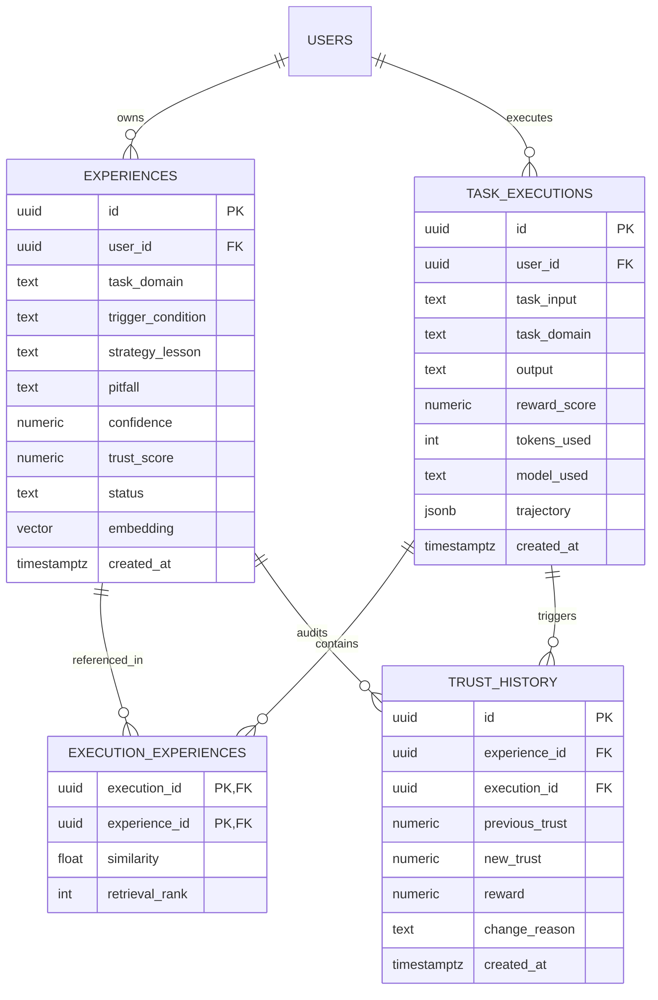

# Database / Data Design

**Project:** Adaptive AI Agent with Persistent Experience Memory  
**Group:** G146 (GenAI / Agentic AI OJT Capstone)  
**Status:** Approved Schema Baseline (Month 2 Specification)  

---

## Core Tables

The persistence layer is implemented in PostgreSQL 15 on Supabase with the `pgvector` extension enabled.

### 1. `experiences` (The Experience Store)
Stores distilled, generalizable units of operational knowledge extracted from agent task executions.

| Column | Type | Constraints / Defaults | Description |
|---|---|---|---|
| `id` | `uuid` | `primary key default gen_random_uuid()` | Unique experience identifier |
| `user_id` | `uuid` | `references auth.users(id) on delete cascade` | Owner user for multi-tenancy & RLS |
| `task_domain` | `text` | `not null` | Technical domain (e.g., `research`, `coding`, `reasoning`) |
| `trigger_condition`| `text` | `not null` | Contextual cue or environmental state that activates this rule |
| `strategy_lesson` | `text` | `not null` | Actionable operational guidance on how to succeed |
| `pitfall` | `text` | `default null` | Negative constraint: specific mistake or anti-pattern to avoid |
| `confidence` | `numeric(4,3)` | `not null check (confidence between 0.0 and 1.0)` | Initial model belief score emitted by Reflector (default `0.850`) |
| `trust_score` | `numeric(4,3)` | `not null default 0.850 check (trust_score between 0.0 and 1.0)` | Empirical reliability metric updated dynamically via EMA |
| `success_count` | `int` | `not null default 0` | Cumulative count of successful task executions reusing this memory |
| `failure_count` | `int` | `not null default 0` | Cumulative count of failed task executions reusing this memory |
| `status` | `text` | `not null default 'candidate' check (status in ('candidate', 'active', 'deprecated'))` | Lifecycle state: `candidate` (new), `active` (retrievable), `deprecated` (quarantined) |
| `embedding` | `vector(1536)` | `not null` | Semantic embedding of combined Trigger + Strategy (384-dim for MiniLM, 1536-dim for OpenAI) |
| `metadata` | `jsonb` | `default '{}'::jsonb` | Extensible metadata (source task ID, model version, benchmark split) |
| `created_at` | `timestamptz` | `default now()` | Immutable creation timestamp |
| `updated_at` | `timestamptz` | `default now()` | Timestamp of last trust or status update |

### 2. `task_executions` (Execution Telemetry Log)
Maintains an end-to-end execution record of every task dispatched to the LangGraph agent.

| Column | Type | Constraints / Defaults | Description |
|---|---|---|---|
| `id` | `uuid` | `primary key default gen_random_uuid()` | Unique execution run identifier (`run_id`) |
| `user_id` | `uuid` | `references auth.users(id) on delete cascade` | Executing user |
| `task_input` | `text` | `not null` | Raw user query or prompt submitted to the agent |
| `task_domain` | `text` | `not null` | Domain category inferred or provided |
| `output` | `text` | `default null` | Final text output emitted by the agent |
| `success` | `boolean` | `default null` | Boolean task success outcome |
| `reward_score` | `numeric(4,3)` | `check (reward_score between 0.0 and 1.0)` | Scalar evaluation metric $R_t \in [0.0, 1.0]$ |
| `iterations` | `int` | `default 1` | Number of execution turns / tool iterations taken |
| `execution_time_ms`| `int` | `default null` | End-to-end wall-clock latency in milliseconds |
| `tokens_used` | `int` | `default null` | Total LLM tokens consumed (prompt + completion) |
| `model_used` | `text` | `not null` | Model identifier string (e.g., `groq/llama-3.3-70b-versatile`) |
| `trajectory` | `jsonb` | `default '[]'::jsonb` | Full execution trace containing tool calls, tool results, and scratchpad |
| `created_at` | `timestamptz` | `default now()` | Execution timestamp |

### 3. `trust_history` (Immutable Audit Trail)
An append-only audit ledger recording every trust score transition, guaranteeing research reproducibility and model drift observability.

| Column | Type | Constraints / Defaults | Description |
|---|---|---|---|
| `id` | `uuid` | `primary key default gen_random_uuid()` | Unique ledger entry identifier |
| `experience_id` | `uuid` | `references public.experiences(id) on delete cascade` | Target memory item being updated |
| `execution_id` | `uuid` | `references public.task_executions(id) on delete cascade` | Run whose outcome triggered this trust modification |
| `previous_trust` | `numeric(4,3)` | `not null` | Trust score before execution update |
| `new_trust` | `numeric(4,3)` | `not null` | Trust score after applying EMA update equation |
| `reward` | `numeric(4,3)` | `not null` | Empirical reward signal $R_t$ from the execution |
| `change_reason` | `text` | `not null` | Descriptive tag (e.g., `task_success_ema`, `task_failure_ema`, `quarantined_low_trust`) |
| `created_at` | `timestamptz` | `default now()` | Immutable timestamp of score transition |

### 4. `execution_experiences` (Many-to-Many Re-use Junction)
Tracks exactly which memories were retrieved and injected into the prompt for any specific execution.

| Column | Type | Constraints / Defaults | Description |
|---|---|---|---|
| `execution_id` | `uuid` | `references public.task_executions(id) on delete cascade` | Target task execution |
| `experience_id` | `uuid` | `references public.experiences(id) on delete cascade` | Retrieved experience memory |
| `similarity` | `float` | `not null` | Cosine similarity score between task query and memory vector |
| `retrieval_rank`| `int` | `not null` | 1-based composite ranking position injected into context |
| `primary key` | `(execution_id, experience_id)` | Composite key | Enforces unique link per task run |

---

## ER-style Relationships



---

## Indexes

To guarantee sub-15ms retrieval and zero-bottleneck updates:

```sql
-- Relational composite index for domain-filtered active memory lookups
create index if not exists idx_experiences_domain_status 
on public.experiences(task_domain, status);

-- Index for ordering memories by trust
create index if not exists idx_experiences_trust 
on public.experiences(trust_score desc);

-- Index for user task execution timelines
create index if not exists idx_task_executions_user 
on public.task_executions(user_id, created_at desc);

-- Index for querying an experience's trust evolution audit trail
create index if not exists idx_trust_history_exp 
on public.trust_history(experience_id, created_at desc);

-- Hierarchical Navigable Small World (HNSW) vector index for sub-15ms similarity search
create index if not exists idx_experiences_embedding on public.experiences
using hnsw (embedding vector_cosine_ops)
with (m = 16, ef_construction = 64);
```

### Why HNSW over IVFFlat?
* **Zero Training Phase:** Unlike IVFFlat, which requires a pre-built cluster list and re-indexing when data grows, HNSW builds incrementally as rows are inserted.
* **Higher Recall at Low Latency:** Provides $>98\%$ recall with queries resolving in $<5\text{ ms}$ on datasets under 100,000 vectors.
* **Parameters:** $m = 16$ (bidirectional links per node) and $ef\_construction = 64$ (size of dynamic candidate list during graph building) balance index build memory against search accuracy.

### Composite Retrieval Stored Procedure (RPC)
Semantic retrieval is executed server-side via `match_experiences`:

```sql
create or replace function match_experiences(
    query_embedding vector(1536),
    match_threshold float default 0.70,
    match_count int default 3,
    filter_domain text default null
)
returns table (
    id uuid,
    task_domain text,
    trigger_condition text,
    strategy_lesson text,
    pitfall text,
    confidence numeric,
    trust_score numeric,
    similarity float
)
language sql stable
as $$
    select
        e.id,
        e.task_domain,
        e.trigger_condition,
        e.strategy_lesson,
        e.pitfall,
        e.confidence,
        e.trust_score,
        1 - (e.embedding <=> query_embedding) as similarity
    from public.experiences e
    where e.status = 'active'
      and (filter_domain is null or e.task_domain = filter_domain)
      and (1 - (e.embedding <=> query_embedding)) > match_threshold
    order by (1 - (e.embedding <=> query_embedding)) * 0.70 + (e.trust_score * 0.30) desc
    limit match_count;
$$;
```

---

## Data Lifecycle

The lifecycle of an experience memory adheres to a strict state-machine governance:

```text
[Task Run] ──> [Reflect Node] ──> [Candidate] ──> (Deduplication) ──> [Active]
                                                                        │
                                                                 (EMA Updates)
                                                                        │
                                              ┌─────────────────────────┴────────────────────────┐
                                              ▼                                                  ▼
                                     [High Trust: S ≥ 0.70]                            [Low Trust: S < 0.35]
                                    (Preferred in Retrieval)                                     │
                                                                                                 ▼
                                                                                       [Deprecated / Quarantined]
                                                                                       (Excluded from Retrieval)
```

1. **Extraction / Candidate Creation:** After an agent trajectory is evaluated, `reflect_node` distills `{Trigger, Strategy, Pitfall}` and inserts a record into `experiences` with status `candidate` and initial `confidence = 0.850`.
2. **Activation:** Experiences undergo a cosine-distance deduplication check ($\text{distance} < 0.10$). If unique, they transition to `active` and become retrievable.
3. **Re-use & Attribution:** When retrieved and injected into the prompt for an execution, `execution_experiences` records the linkage with the task run.
4. **Trust Evolution:** `trust_node` recalculates `trust_score` via EMA based on execution outcome $R_t \in [0.0, 1.0]$ and appends an immutable entry to `trust_history`.
5. **Quarantine / Deprecation:** If `trust_score < 0.35`, the memory status transitions to `deprecated`. The `match_experiences` RPC query filters on `status = 'active'`, automatically isolating the bad memory and preventing negative transfer.
6. **Audit & Archival:** Deprecated records are never deleted; they are preserved for historical audit trails, model drift detection, and capstone evaluation defense.
