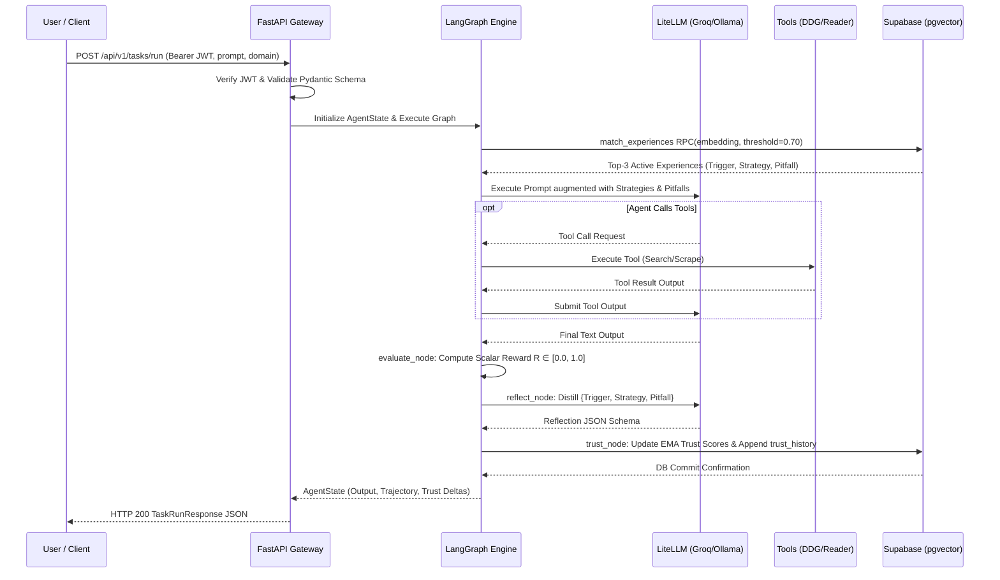

# Low-Level Design (LLD)

**Project:** Adaptive AI Agent with Persistent Experience Memory  
**Group:** G146 (GenAI / Agentic AI OJT Capstone)  
**Status:** Approved Low-Level Design (Month 2 Specification)  

---

## Backend Modules

The backend is built as an asynchronous FastAPI application organized cleanly by concern:

```text
backend/
├── app/
│   ├── main.py                     # FastAPI application factory, CORS, exception handlers
│   ├── core/
│   │   ├── config.py               # Pydantic Settings (Supabase URLs, LiteLLM keys, environment)
│   │   ├── security.py             # JWT verification dependency & CORS middleware
│   │   └── logging.py              # Loguru structured JSON logger with correlation IDs
│   ├── api/
│   │   └── v1/
│   │       ├── router.py           # V1 API router aggregator
│   │       ├── health.py           # GET /api/v1/health endpoint
│   │       ├── tasks.py            # POST /api/v1/tasks/run & GET /api/v1/tasks/{id}
│   │       ├── experiences.py      # GET /api/v1/experiences (search, filter, inspect)
│   │       ├── trust.py            # GET /api/v1/trust/history & audit endpoints
│   │       └── models.py           # GET /api/v1/models (list supported BYOK models)
│   ├── agent/
│   │   ├── graph.py                # LangGraph StateGraph assembly and compiled workflow
│   │   ├── state.py                # TypedDict AgentState definition
│   │   ├── nodes/
│   │   │   ├── retrieve.py         # retrieve_node (embedding & composite ranking)
│   │   │   ├── execute.py          # execute_node (prompt augmentation & LiteLLM invocation)
│   │   │   ├── evaluate.py         # evaluate_node (deterministic heuristic outcome evaluation)
│   │   │   ├── reflect.py          # reflect_node (structured lesson extraction)
│   │   │   └── trust.py            # trust_node (EMA score updating & quarantine logic)
│   │   └── tools/
│   │       ├── search.py           # DuckDuckGo search wrapper
│   │       ├── reader.py           # Jina AI Reader URL content extractor
│   │       └── python_repl.py      # Restricted Python code execution tool
│   ├── db/
│   │   ├── session.py              # asyncpg connection pool & Supabase client factory
│   │   └── repositories/
│   │       ├── experience_repo.py  # CRUD and match_experiences RPC calls
│   │       └── task_repo.py        # Task executions & trust history persistence
│   └── schemas/
│       ├── task.py                 # TaskRunRequest, TaskRunResponse, TrajectoryStep
│       ├── experience.py           # ExperienceRead, ExperienceCreate, ReflectionSchema
│       └── trust.py                # TrustHistoryRead, TrustAdjustmentEvent
├── tests/
│   ├── test_health.py              # Unit tests for /health endpoint
│   ├── test_retrieval.py           # Tests for composite ranking & RPC
│   ├── test_agent_graph.py         # LangGraph node transition tests
│   └── test_trust_engine.py        # EMA formula & quarantine verification tests
├── requirements.txt
└── Dockerfile
```

---

## Agent Service

The core orchestration engine compiles a cyclical `StateGraph` in LangGraph using a typed execution context:

```python
class AgentState(TypedDict):
    task_id: str
    task_input: str
    task_domain: str
    user_id: str
    model_override: Optional[str]
    retrieved_memories: List[Dict[str, Any]]
    system_prompt: str
    messages: Annotated[List[BaseMessage], operator.add]
    trajectory: List[Dict[str, Any]]
    turn_count: int
    final_output: Optional[str]
    success: Optional[bool]
    reward_score: float
    reflection: Optional[Dict[str, Any]]
    trust_updates: List[Dict[str, Any]]
    error: Optional[str]
```

### Node Execution Functions
1. `async def retrieve_node(state: AgentState) -> Dict[str, Any]`
2. `async def execute_node(state: AgentState) -> Dict[str, Any]`
3. `async def evaluate_node(state: AgentState) -> Dict[str, Any]`
4. `async def reflect_node(state: AgentState) -> Dict[str, Any]`
5. `async def trust_node(state: AgentState) -> Dict[str, Any]`

---

## Key Interfaces

### 1. `ExperienceRepository` Interface
- `async get_by_id(id: UUID) -> Optional[Experience]`
- `async query_composite(embedding: List[float], domain: Optional[str], threshold: float, limit: int) -> List[ExperienceMatch]`
- `async create_candidate(lesson: ReflectionSchema, embedding: List[float], user_id: UUID) -> Experience`
- `async update_trust(id: UUID, new_trust: float, status: str) -> None`
- `async check_vector_collision(embedding: List[float], threshold: float = 0.10) -> Optional[UUID]`

### 2. `AgentWorkflowEngine` Interface
- `async run_task(request: TaskRunRequest, user_id: UUID) -> TaskRunResponse`
- `async run_step_stream(request: TaskRunRequest, user_id: UUID) -> AsyncGenerator[WorkflowEvent, None]`

### 3. `ModelGateway` (LiteLLM) Interface
- `async completion(model: str, messages: List[Dict[str, str]], tools: Optional[List[Dict]], api_key: Optional[str]) -> ModelResponse`

---

## Sequence



---

## Design Patterns

1. **State Machine Pattern (LangGraph):** Decouples individual cognitive phases (retrieval, action, evaluation, reflection, memory lifecycle) into pure, testable node transitions governed by `AgentState`.
2. **Adapter Pattern (LiteLLM Gateway):** Unifies diverse LLM API protocols (Groq, Google Gemini, Anthropic, local Ollama) behind a singular standard call convention, enabling zero-code provider switching.
3. **Repository Pattern (Data Access):** Isolates Supabase SQL queries and `pgvector` stored procedures behind `ExperienceRepository` and `TaskRepository`, preventing raw database logic from polluting the agent workflow.
4. **Strategy Pattern (Outcome Evaluation):** Allows pluggable evaluation heuristics depending on the task domain (e.g., regex goal matching for reasoning, return code verification for coding, factuality checking for research).

---

## Validation

- **Request Payloads:** Pydantic v2 enforces non-empty strings, supported domain enums (`research`, `coding`, `reasoning`), valid UUID formats, and bounded threshold ranges ($\theta_{\text{sim}} \in [0.5, 0.99]$).
- **Authentication Tokens:** FastAPI dependencies parse the Supabase JWT header, verifying cryptographic signatures and decoding the subject user UUID (`auth.uid()`).
- **Structured Reflection Enforcement:** The LLM's reflection output is validated against `ReflectionSchema` using Pydantic parser. If the model emits malformed JSON, a retry wrapper prompts the model to correct its formatting.

---

## Error Handling

1. **Centralized Exception Handlers:** FastAPI intercepts unhandled exceptions, logs full stack traces with correlation IDs internally, and emits standard JSON error envelopes:
   ```json
   {
     "error": {
       "code": "TASK_EXECUTION_FAILED",
       "message": "The agent encountered an unrecoverable tool execution failure.",
       "correlation_id": "corr_8f12a3b4c5d6",
       "details": {}
     }
   }
   ```
2. **LLM Provider Timeout & Failover:** LiteLLM operations employ a 15-second timeout. If Groq triggers HTTP 429 (rate limited) or 503 (unavailable), the gateway automatically reroutes the prompt to local Ollama or Gemini 1.5 Flash.
3. **Infinite Loop Mitigation:** LangGraph enforces `max_turns = 4`. If the model fails to emit a terminal response after 4 iterations, `evaluate_node` marks the task as failed ($R_t = 0.0$) and halts execution gracefully.
